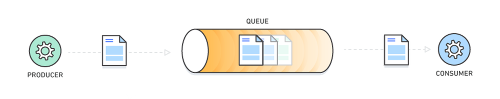

# Rabbit Message Queue Practice

## Message Queue?
시스템 간 비동기 통신을 지원하는 기술로, 메시지를 저장하고 이를 지정된 순서대로 처리할 수 있는 큐(Queue)를 활용한 구조

메시지 큐는 서로 독립적으로 실행되는 어플리케이션들이 통신할 때 데이터를 손쉽게 교환할 수 있도록 돕는다.

### 주요 구성 요소
* Producer (생산자): 메시지를 생성하고 큐에 넣는 역할을 하는 주체. 생산자는 큐에 메시지를 넣은 후, 해당 메시지의 처리를 기다리지 않고 다른 작업을 지속할 수 있다.
* Queue (큐): 메시지를 임시로 저장하는 공간. 메시지는 큐에 FIFO (First-In, First-Out) 방식으로 쌓이며, 처리 순서는 큐에 들어간 순서를 따른다.
* Consumer (소비자): 큐에서 메시지를 꺼내고 처리하는 주체. 소비자는 큐에 있는 메시지를 하나씩 꺼내 처리하며, 필요에 따라 메시지가 처리되면 삭제할 수 있다.
* Broker (중개자): 메시지를 큐에 저장하고 이를 소비자에게 전달하는 역할을 한다. 대표적인 메시지 브로커로는 RabbitMQ, Apache Kafka, ActiveMQ 등이 있다.

### 프로세스



1. 생산자가 메시지를 생성하여 큐에 전달한다.
2. 큐는 메시지를 보관하며, 소비자가 이를 처리할 준비가 될 때까지 기다린다.
3. 소비자가 큐에서 메시지를 꺼내고, 메시지를 처리한다.

### 특징
* 비동기성: 생산자와 소비자는 서로의 상태에 독립적으로 동작할 수 있다. 생산자는 메시지를 큐에 넣고 바로 다른 작업을 할 수 있으며, 소비자는 자신이 준비되었을 때 메시지를 처리할 수 있다.
* 확장성: 메시지 큐를 사용하면 여러 생산자와 소비자가 동시에 작업을 수행할 수 있어 시스템 확장이 용이하다. 새로운 소비자를 추가하여 처리 성능을 쉽게 향상시킬 수 있다.
* 내결함성: 메시지 큐는 시스템 장애가 발생해도 메시지를 안전하게 보관할 수 있어 데이터 유실을 방지할 수 있다. 시스템 복구 후, 메시지는 다시 소비자에게 전달된다.
* 부하 분산: 메시지 큐는 처리량이 많아도 큐에서 대기하는 메시지를 순차적으로 처리하므로, 순간적인 부하를 줄여 시스템 안정성을 높일 수 있다.

## RabbitMQ - Hello world

* Producer: 메시지를 보내는 프로그램
* Consumer: 메시지를 기다리는 프로그램
* Queue: 본질적으로 큰 메시지 버퍼, 여러 생산자가 큐로 메시지를 보내거나, 여러 소비자가 데이터를 수신할 수 있다.

### Send - Produce 예제


```java
public class Send {
    private final static String QUEUE_NAME = "hello";

    public static void main(String[] argv) throws IOException, TimeoutException {
        ConnectionFactory factory = new ConnectionFactory();
        factory.setHost("localhost");
        factory.setPort(5672);
        factory.setUsername("twlee");
        factory.setPassword("test123");
```

큐 이름은 hello로 지정, docker compose로 설정한 rabbit mq 정보를 factory에 넘긴다.

```java
try(Connection connection = factory.newConnection();
Channel channel = connection.createChannel()){
        channel.

queueDeclare(QUEUE_NAME, false,false,false,null);

String message = "Hello World";
    channel.

basicPublish("",QUEUE_NAME, null,message.getBytes());
        System.out.

println(" [x] Sent '"+message +"'");
}
```

`Connection`과 `Channel`은 `AutoCloseable`을 구현하기 때문에 try-with-resource 문을 사용하여 활용하면 좋다.

큐를 선언하는 것은 멱등적이다. 이미 존재하지 않는 경우멘 생성되며, 메시지 내용은 바이트 배열이다.

### Receiving - Consumer 예쩨


```java
public class Recv {

    private final static String QUEUE_NAME = "hello";

  public static void main(String[] args) throws IOException, TimeoutException {
    ConnectionFactory factory = new ConnectionFactory();
    factory.setHost("localhost");
    factory.setPort(5672);
    factory.setUsername("twlee");
    factory.setPassword("test123");
    Connection connection = factory.newConnection();
    Channel channel = connection.createChannel();

    channel.queueDeclare(QUEUE_NAME, false, false, false, null);
    System.out.println(" [*] Waiting for messages. To exit press CTRL+C");

    DeliverCallback deliverCallback = (consumerTag, delivery) -> {
      String message = new String(delivery.getBody(), StandardCharsets.UTF_8);
      System.out.println(" [x] Received '" + message + "'");
    };
    channel.basicConsume(QUEUE_NAME, true, deliverCallback, consumerTag -> { });
  }
```

`Send`클래스가 퍼블리시하는 큐와 일치한다는 점을 유의하자. 퍼블리셔보다 컨슈머가 시작될 수 있으므로 메시지를 소비하기 전에 큐가 존재하는지 확인해야 한다.

try-with-resource 문을 여기서 사용하지 않는 이유는, 컨슈머가 비동기적으로 메시지를 기다리는 프로세스가 계속 살아있어야 하므로, 자동으로 모든 것을 닫는 것은 이상하기 때문이다

퍼블리셔는 비동기적으로 메시지를 푸시 할 것이므로, 우리는 메시지를 버퍼링하는 객체형태의 콜백을 사용한다. 이것이 `DeliverCallback`이 하는 일이다.

### Send - Recv 결과

먼저 컨슈머를 실행 시켜 놓고 시작한다.

위와 같이 Send 클래스를 실행하면 메시지를 큐에 푸시하고


Recv 클래스는 콜백 형태로 큐에서 메시지를 수신 받는다

## Work Queue (작업 대기열)

여러 worker간에 시간이 많이 걸리는 작업을 분배하기 위해 사용되는 큐를 만들어보자, 이러한 작업의 주요 아이디어는 리소스 집약 작업을 즉시 수행하고 완료될 때까지 기다리는 것을 방지하기 위함이다
대신 나중에 수행하도록 작업을 예약한다.

복잡한 작업을 나타내는 문자열을 보내고, 실제 작업 대신 문자열에서 `.`의 수를 복잡성, 1초 작업 기준으로 사용한다. 예를 들어, `hello...`는 3초가 소요된다

매개변수에서 임의의 메시지를 보낼 수 있는 프로그램, 작업 대기열에 작업을 예약하는 역할
```java
public class NewTask {
    private final static String QUEUE_NAME = "hello";

    public static void main(String[] argv) throws IOException, TimeoutException {
        ConnectionFactory factory = new ConnectionFactory();
        factory.setHost("localhost");
        factory.setPort(5672);
        factory.setUsername("twlee");
        factory.setPassword("test123");
        try (Connection connection = factory.newConnection();
             Channel channel = connection.createChannel()) {
            channel.queueDeclare(QUEUE_NAME, false, false, false, null);
            String message = String.join(" ", argv);
            channel.basicPublish("", QUEUE_NAME, null, message.getBytes());
            System.out.println(" [x] Sent '" + message + "'");
        }
    }
}
```

메시지의 점 당 1초의 작업을 수행하는 프로그램
```java
public class Worker {

    private final static String QUEUE_NAME = "hello";

    public static void main(String[] args) throws IOException, TimeoutException {
        ConnectionFactory factory = new ConnectionFactory();
        factory.setHost("localhost");
        factory.setPort(5672);
        factory.setUsername("twlee");
        factory.setPassword("test123");
        Connection connection = factory.newConnection();
        Channel channel = connection.createChannel();

        channel.queueDeclare(QUEUE_NAME, false, false, false, null);
        System.out.println(" [*] Waiting for messages. To exit press CTRL+C");

        DeliverCallback deliverCallback = (consumerTag, delivery) -> {
            String message = new String(delivery.getBody(), "UTF-8");
            System.out.println(" [x] Received '" + message + "'");
            try {
                doWork(message);
            } catch (InterruptedException e) {
                throw new RuntimeException(e);
            } finally {
                System.out.println(" [x] Done");
            }
        };
        channel.basicConsume(QUEUE_NAME, true, deliverCallback, consumerTag -> { });
    }

    private static void doWork(String task) throws InterruptedException {
        for (char ch: task.toCharArray()) {
            if (ch == '.') {
                Thread.sleep(1000);
            }
        }
    }

}
```

### Round-Robin Dispatching
두 개의 워커를 실행하고, 작업을 3개 발행해보자 이후 워커 인스턴스에서의 작업 분배 과정을 살펴보자

```
 [*] Waiting for messages. To exit press CTRL+C
 [x] Received 'first...'
 [x] Done
 [x] Received 'third.....'
 [x] Done
```

```
 [*] Waiting for messages. To exit press CTRL+C
 [x] Received 'second....'
 [x] Done
```
기본적으로 RabbitMQ는 각 메시지를 순서대로 다음 소비자에게 보낸다. 평균적으로 모든 소비자는 같은 수의 메시지를 받는다.

### Explicit Ack
기존 소스에서 autoAck 부분이 true인 것을 확인 할 수 있는데, 메시지를 수신 받자마자 `ACK`를 보낸다.

소요 시간이 긴 작업이 있을 때 실패 할 경우 다른 워커에서 처리하길 원한다면 명시적인 응답을 할 수 있다.

```java
channel.basicQos(1);

DeliverCallback deliverCallback = (consumerTag, delivery) -> {
    String message = new String(delivery.getBody(), StandardCharsets.UTF_8);
    System.out.println(" [x] Received '" + message + "'");
    try {
        doWork(message);
    } catch (InterruptedException e) {
        throw new RuntimeException(e);
    } finally {
        System.out.println(" [x] Done");
        channel.basicAck(delivery.getEnvelope().getDeliveryTag(), false);
    }
};
channel.basicConsume(QUEUE_NAME, false, deliverCallback, consumerTag -> { });
```
이 경우 메시지를 처리하는 동안 워커가 종료되면 rabbitMq는 메시지가 완전히 처리되지 않음을 이해하고 큐에 넣고, 다른 온라인 상태인 워커에게 전달한다. 

### Message Durability
RabbitMQ 서버가 종료, 충돌되어도 큐와 메시지를 보존하는 방법은 Durability 속성을 활성화 하는 것이다.

이 경우는 디스크에 저장하는 방법을 쓴다 다만 레퍼런스에서도 써있듯 저장 시간이라는게 존재하므로(매우 짧은) 실제로 기록되지 않으면 보존되지 않는다.

```java
boolean durable = true;
channel.queueDeclare("test_queue", durable, false, false, null);
```

### Fair Dispatch

기존 디스패칭 방법은 두 명의 워커가 있는 경우 한 워커는 끊임없이 일하고, 다른 워커는 일을 하지 않는 것을 볼 수 있다. 이러한 상황을 RabbitMQ는 모르는 경우가 많다.

RabbitMQ는 메시지가 큐에 들어올 때 메시지를 전송 하므로 발생하는 현상인데, QOS를 설정하여 어느정도 방지 할 수 있다.
`Request a specific prefetchCount "quality of service" settings for this channel.`


```java
channel.basicQos(1);
```

한 번에 워커에게 두 개 이상의 메시지를 제공하지 않도록 지시한다. 이전 메시지를 처리하고 확인할 때까지 워커에게 메시지를 전달하지 않게 된다.(prefetchCount 만큼)

## Pub-Sub
이전에는 정확히 한명의 소비자에게 작업이 전달되었다. Pub-Sub 구조는 구독하고 있는 소비자 전부에게 전달하게 된다.

간단한 로깅 시스템으로 해당 구조를 구현해보도록 하자, 게시된 로그 메시지는 모든 수신자에게 브로드 캐스팅된다.


핵심 아이디어는 생산자가 큐에 직접 메시지를 보내지 않는 다는 것이다. 대게 많은 큐 디자인에서 생산자는 어떤 큐에 메시지를 전달할지 모르는 경우가 많다.

대신 생산자는 Exchange(교환)에만 메시지를 보낼 수 있다. Exchange는 생산자가 보낸 메시지를 적절한 큐에 전달하는 역할을 한다

### Exchange 유형
* Direct Exchange (직접 교환)
  * Routing Key를 기반으로 메시지를 큐에 전달한다.
  * 생산자가 메시지를 보낼 때 특정 라우팅 키를 지정하면, 해당 키와 일치하는 큐에만 메시지가 전달된다.
  * 예: 만약 routing_key = "error" 라고 지정한 메시지를 보낼 경우, error라는 키로 바인딩된 큐에만 메시지가 전달된다.
* Fanout Exchange (팬아웃 교환)
  * 라우팅 키와 관계없이 모든 큐로 메시지를 브로드캐스트한다.
  * 바인딩된 모든 큐에 동일한 메시지가 전달되므로, 주로 로그나 알림 시스템과 같이 여러 소비자가 동일한 메시지를 받아야 할 때 유용하다.
  * 예: 팬아웃 교환을 통해 메시지가 들어오면, 바인딩된 모든 큐에 메시지가 복사되어 전달된다.
* Topic Exchange (주제 교환)
  * 패턴 기반의 라우팅을 지원한다. 라우팅 키에 와일드카드 문자를 사용하여 메시지를 여러 큐에 전달할 수 있다.
  * \*은 하나의 단어를, #은 0개 이상의 단어를 매칭할 수 있다.
  * 예: routing_key = "user.*"으로 바인딩된 큐는 user.login, user.logout 등과 같은 키로 발송된 메시지를 모두 수신한다.
* Headers Exchange (헤더 교환)
  * 라우팅 키 대신 메시지의 헤더 속성을 기반으로 큐에 메시지를 전달한다.
  * 메시지에 포함된 헤더 정보가 큐에 정의된 조건과 일치할 경우 메시지가 전달된다.
  * 예: x-match=all 헤더로 설정하면 모든 조건을 만족하는 큐에만 메시지를 보내고, x-match=any로 설정하면 한 가지 조건만 만족해도 메시지가 전달된다.

이번 로깅 시스템은 전체 수신자에게 브로드캐스팅 해야하므로 `Fanout`방식을 이용하도록 한다.
```java
channel.exchangeDeclare("logs", "fanout");
```

이전 예제들에서는 Exchange를 몰라도 메시지를 송수신했다. 가능한 이유는 `""`로 식별하는 기본 Exchange를 사용 했기 때문이다.
```java
channel.basicPublish("", QUEUE_NAME, null, message.getBytes());
```
첫번째 매개변수가 Exchange 명이다.

이제는 Exchange 명을 정했으므로 다음과 같이 특정한 Exchange를 사용할 수 있다.
```java
channel.basicPublish( "logs", "", null, message.getBytes());
```

### Temporary Queues (임시 큐)
이전 예제에서는 명명된 큐를 사용하여 해당 큐만을 이용했다. 하지만 이번 예제에서의 로거는 특정 큐의 메시지 뿐만 아니라 모든 로깅관련 메시지를 다룰 수 있어야 한다.

이를 위해서는 다음과 같은 조건이 필요하다.
1. Rabbit에 로거가 연결 될 때 마다(수신자) 새로운 Queue가 필요하다. 이를 위해 임시 큐를 만들거나, 특정한 방법으로 큐를 생성해야한다.
2. 수신자가 연결을 끊으면 Queue는 삭제되어야 한다.

Java API에서는 `queueDeclare()`에서 매개변수를 제공하지 않으면 기본적으로 exclusive(독점), autodelete, non-durable한 큐를 생성하게 된다.
```java
String queueName = channel.queueDeclare().getQueue();
```
이름 또한 랜덤으로 생성된다 (예:`amq.gen-JzTY20BRgKO-HjmUJj0wLg`)

### 바인딩 (Binding)
Fanout Exchange와 큐를 만들었으므로, Exchange와 큐를 연결 해야하는데 이를 바인딩이라 한다.(Exchange와 큐 사이의 연결을 의미)


```java
channel.queueBind(queueName, "logs", "");
```

### 전체 구조


전체적인 구조는 위와 같이 구성된다.

이전과는 다르게 특정한 이름의 Exchange를 이용했으며, Fanout 방식으로 전체에게 브로드캐스팅하게 된다.

```java
public class EmitLog {

  private static final String EXCHANGE_NAME = "logs";

  public static void main(String[] argv) throws Exception {
    ConnectionFactory factory = new ConnectionFactory();
    factory.setHost("localhost");
    factory.setPort(5672);
    factory.setUsername("twlee");
    factory.setPassword("test123");
    try (Connection connection = factory.newConnection();
         Channel channel = connection.createChannel()) {
      channel.exchangeDeclare(EXCHANGE_NAME, "fanout");

      String message = argv.length < 1 ? "info: Hello World!" :
              String.join(" ", argv);

      channel.basicPublish(EXCHANGE_NAME, "", null, message.getBytes(StandardCharsets.UTF_8));
      System.out.println(" [x] Sent '" + message + "'");
    }
  }
}
```
실행 매개변수로 전달한 메시지를 선언한 Exchange에 게시하는 생산자다.

```java
public class ReceiveLogs {
  private static final String EXCHANGE_NAME = "logs";

  public static void main(String[] argv) throws Exception {
    ConnectionFactory factory = new ConnectionFactory();
    factory.setHost("localhost");
    factory.setPort(5672);
    factory.setUsername("twlee");
    factory.setPassword("test123");
    Connection connection = factory.newConnection();
    Channel channel = connection.createChannel();

    channel.exchangeDeclare(EXCHANGE_NAME, "fanout");
    String queueName = channel.queueDeclare().getQueue();
    channel.queueBind(queueName, EXCHANGE_NAME, "");

    System.out.println(" [*] Waiting for messages. To exit press CTRL+C");

    DeliverCallback deliverCallback = (consumerTag, delivery) -> {
      String message = new String(delivery.getBody(), StandardCharsets.UTF_8);
      System.out.println(" [x] Received '" + message + "'");
    };
    channel.basicConsume(queueName, true, deliverCallback, consumerTag -> { });
  }
}
```
특정 Exchange를 구독하고 있다가 메시지가 오면 출력하게 되는 수신자다.