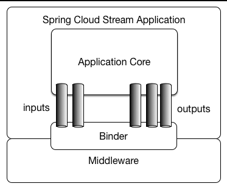
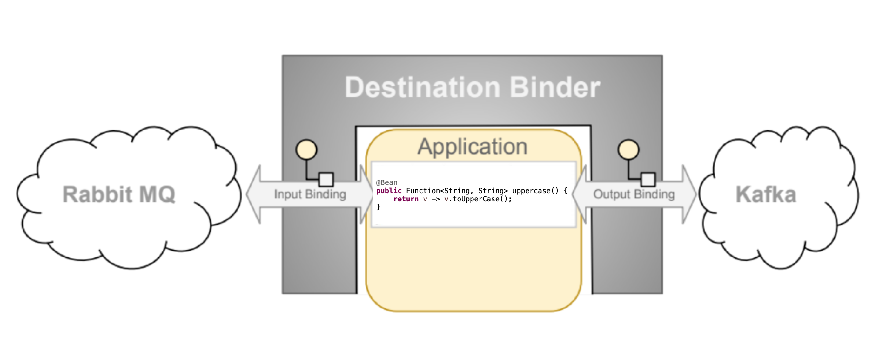

# Spring Cloud Stream Rabbit MQ



## Spring Cloud Stream의 주요 특징

1. 메시지 기반 아키텍처: Spring Cloud Stream은 이벤트 기반 아키텍처를 사용하여 서비스 간 통신을 메시지로 처리한다. 서비스 간에 강한 결합을 피하고 느슨한 결합을 유지할 수 있다.
2. 바인딩(Binder) 추상화: Spring Cloud Stream의 핵심 개념 중 하나는 "바인딩"이다. 이는 애플리케이션 코드와 메시징 미들웨어 간의 추상화 계층을 제공하며, 개발자는 구체적인 메시징 시스템의 API에 의존하지 않고도 메시지 송수신 로직을 구현할 수 있다. Spring Cloud Stream은 Kafka, RabbitMQ 등 여러 메시징 시스템을 지원하는 바인더(Binder)를 제공한다.
3. 데이터 스트림 처리: Spring Cloud Stream은 스트리밍 데이터를 간단한 설정으로 처리할 수 있으며, 고성능 스트리밍 처리 파이프라인을 구축할 수 있다.
4. 동적 스케일링: Spring Cloud Stream은 기본적으로 클라우드 네이티브 애플리케이션을 위한 프레임워크이기 때문에, 클라우드 환경에서 동적으로 스케일링이 가능하다. 애플리케이션 인스턴스가 증가하면 스트림 데이터를 여러 인스턴스에 분산시켜 처리할 수 있다.
5. Fault Tolerance: 메시징 시스템을 활용한 구조 덕분에 애플리케이션의 장애 복원력을 강화할 수 있다. 메시지 재시도, 오프셋 관리 등의 기능을 통해 메시지 손실을 방지할 수 있다.




* Destination Binder: 외부 메시징 시스템과의 통합을 제공하는 요소
* Binding: 외부 메시징 시스템과 애플리케이션 간의 브리지로, 메시지 생산자 와 메시지 소비자 (대상 바인더에서 생성)가 제공됨
* Message: 생산자와 소비자가 목적지 바인더(및 외부 메시징 시스템을 통한 다른 애플리케이션)와 통신하는 데 사용하는 표준 데이터 구조

## Functional binding names
외부 메시징 시스템과의 다리 역할을 제공, Spring Cloud Stream 3.0 부터는 Functional 구현 방식을 사용하는게 좋다고 함

### 함수 기반 프로그래밍 모델
함수형 바인딩은 `Function`, `Supplier`, `Consumer`와 같은 자바의 함수형 인터페이스를 사용한다.

* `Function<T, R>`: 메시지를 입력받아 변환 후 반환하는 함수.
* `Consumer<T>`: 메시지를 입력받아 처리하는 함수(반환 값 없음).
* `Supplier<R>`: 메시지를 생성하여 반환하는 함수(입력 없음).

### 바인딩 이름
Spring Cloud Stream에서 각 함수는 메시지 채널에 바인딩되며, 함수 이름은 바인딩 이름으로 사용된다.

```yml
spring:
  cloud:
    stream:
      bindings:
        process-in-0:
          destination: input-topic
        process-out-0:
          destination: output-topic
```
위 설정에서는 `process`라는 함수가 `input-topic`에서 메시지를 받아서 처리하고, `output-topic`으로 메시지를 내보낸다. `process-in-0`은 함수의 입력 채널이고, `process-out-0`은 출력 채널이다.

### 함수 이름 규칙
* input 채널 이름: 함수명-in-인덱스
* output 채널 이름: 함수명-out-인덱스

인덱스는 다중 입력 및 출력을 지원할 때 사용된다. (단일 입-출력 함수는 항상 0)

### 바인딩 구성 예시
```java
@Bean
public Function<String, String> process() {
    return message -> {
        return message.toUpperCase();
    };
}
```
이 `process` 함수는 입력 문자열을 대문자로 반환한다. `input-topic`에서 수신되며, 결과는 `output-topic`으로 보내진다.

## Producing and Consuming Messages
Spring Cloud Stream에서는 `Function`, `Supplier`, `Consumer`를 이용하여 메시지를 생산하고, 처리하고, 소비하는 방식으로 동작한다.

### Producing Message
`Supplier` 인터페이스로 구현하며, 메시지 소스에서 메시지를 생성하여 출력 채널로 보낸다. 메시지 브로커로 보내는 작업은 Spring Cloud Stream에서 자동으로 처리한다.

```java
@Bean
public Supplier<String> produceMessage() {
    return () -> "Hello from Producer";
}
```
위 `produceMessage`함수는 호출 될 때마다 문자열을 생성하고 이를 출력채널을 통해 브로커로 보낸다. 기본적으로 주기적으로 호출되며 메시지를 지속적으로 생성한다. 스프링 프레임워크에서는 폴링 메커니즘으로 매초마다 호출하게 설정되어 있다.
https://docs.spring.io/spring-cloud-stream/reference/spring-cloud-stream/producing-and-consuming-messages.html#polling-configuration-properties

```yml
spring:
  cloud:
    stream:
      bindings:
        produceMessage-out-0:
          destination: output-topic
```
위 `produceMessage` 함수의 출력이 `output-topic`으로 바인딩되도록 구성한다.

### Consuming Messages
메시지 소비는 `Consumer` 인터페이스로 구현한다. 브로커로부터 메시지를 수신하고 해당 메시지를 처리한다.

```java
@Bean
public Consumer<String> consumeMessage() {
    return message -> {
        System.out.println("Received message: " + message);
    };
}
```
위 `consumeMessage`함수는 메시지를 브로커를 통해 입력채널로 받아 처리한다. 
```yml
spring:
  cloud:
    stream:
      bindings:
        consumeMessage-in-0:
          destination: input-topic
```
이 설정으로 `input-topic`에서 메시지를 소비할 수 있도록 `consumeMessage` 함수를 입력 채널에 바인딩한다. 따라서 `input-topic`으로 메시지가 들어오면 자연스럽게 consumeMessage 함수로 전달된다.

## Post processing
기본적인 비즈니스 사이클이 완료된 후 몇가지 추가 작업이 수행될 때 까지 비즈니스 관점에서 완전히 완료되지 않을 때가 있다. `Consume` 및 `StreamBridge` 조합 등으로 처리 할 수도 있지만 Spring cloud stream 4.0.3 부터 이러한 문제를 해결하는 방법을 제공한다.

`PostProcessingFunction` 은 후처리를 위한 특수한 `Function`이고 `postProcess`를 제공한다.

```java
public interface PostProcessingFunction<I, O> extends Function<I, O> {
	default void postProcess(Message<O> result) {
	}
}
```
후처리를 위해 2가지 옵션이 있다

1. `PostProcessingFunction`를 구현하여 후처리 메서드를 작성하고, 기존 함수도 포함 시킨다.
```java
private static class Uppercase implements PostProcessingFunction<String, String> {

	@Override
	public String apply(String input) {
		return input.toUpperCase();
	}

	@Override
	public void postProcess(Message<String> result) {
		System.out.println("Function Uppercase has been successfully invoked and its result successfully sent to target destination");
	}
}
. . .
@Bean
public Function<String, String> uppercase() {
	return new Uppercase();
}
```

2. 기존 구현을 변경하지 않고, 하나의 `postProcess`메서드만 구현하여 기존 함수와 후 처리 함수를 `Bean`으로 구성한다.
```java
private static class Logger implements PostProcessingFunction<?, String> {

	@Override
	public void postProcess(Message<String> result) {
		System.out.println("Function has been successfully invoked and its result successfully sent to target destination");
	}
}
. . .
@Bean
public Function<String, String> uppercase() {
	return v -> v.toUpperCase();
}
@Bean
public Function<String, String> logger() {
	return new Logger();
}
```
이후 function 설정에서 `uppercase|logger`로 설정하면 된다. 참고로 다중으로 `PostProcessingFunction`을 구현하는 경우 마지막 인스턴스만 동작하게 된다.`foo|bar|baz` 의 경우 `baz.postProcess`만 동작 함

## reference
https://docs.spring.io/spring-cloud-stream/reference/preface.html